<h2 align="center">SmartMark – Intelligent Bookmark Management</h2>

<div align="center">


Your Digital Sanctuary for Knowledge

A modern AI-enhanced bookmark manager built with Next.js, Supabase, and React.
Organize, search, and manage bookmarks with a professional interface, secure authentication, and real-time synchronization.

</div>

---

## Overview

SmartMark is a full-stack bookmark management application designed for productivity, knowledge organization, and seamless access across devices. It integrates secure Google authentication, cloud database storage, responsive UI design, and real-time updates.

The project focuses on simplicity, performance, security, and modern UI experience.

---

## Screenshots

<div align="center">

### Login Page
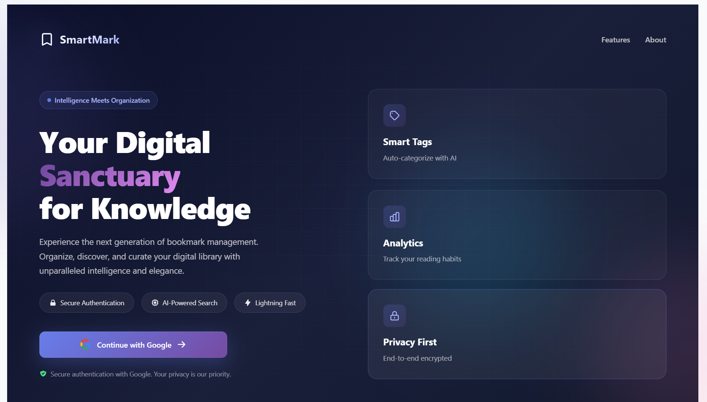

<br><br>

### Dashboard Page
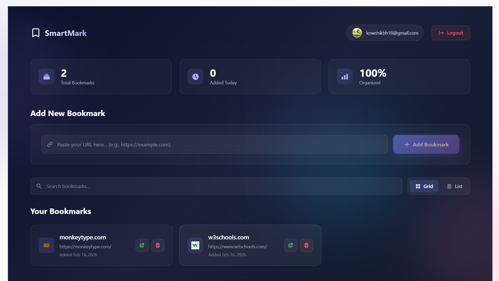

</div>

---

## Features

### Core Features

* Secure Google OAuth authentication via Supabase
* Real-time bookmark synchronization
* Fast bookmark search functionality
* Bookmark add, delete, and management system
* Responsive UI supporting desktop and mobile devices
* Clean modern landing page and dashboard

### Advanced Features

* AI-powered tag suggestions (planned enhancement)
* Bookmark analytics dashboard
* Grid and list viewing modes
* Automatic favicon extraction
* Backup/export capability
* Privacy-focused secure storage

### UI/UX Features

* Gradient modern interface
* Glassmorphism design components
* Smooth animations and transitions
* Modal popup information panels
* Responsive layout system
* Micro-interactions and hover effects

---

## 🔴 Live Demo

👉 [](https://smart-bookmark-theta-nine.vercel.app)

---

## Local Setup

Clone the repository:

```bash
git clone https://github.com/yourusername/smartmark.git
cd smartmark
```

Install dependencies:

```bash
npm install
```

Run development server:

```bash
npm run dev
```

Access locally:

```
http://localhost:3000
```

---

## Tech Stack

### Frontend

* Next.js 15 (App Router)
* React 18
* Styled JSX and modern CSS
* Responsive UI design

### Backend

* Supabase Backend as a Service
* PostgreSQL database
* Real-time subscriptions
* Row Level Security policies

### Authentication

* Google OAuth 2.0 integration
* Secure session management
* Automatic token refresh

### Deployment

* Vercel (recommended platform)
* Netlify optional deployment

---

# Architecture Diagrams

## System Architecture

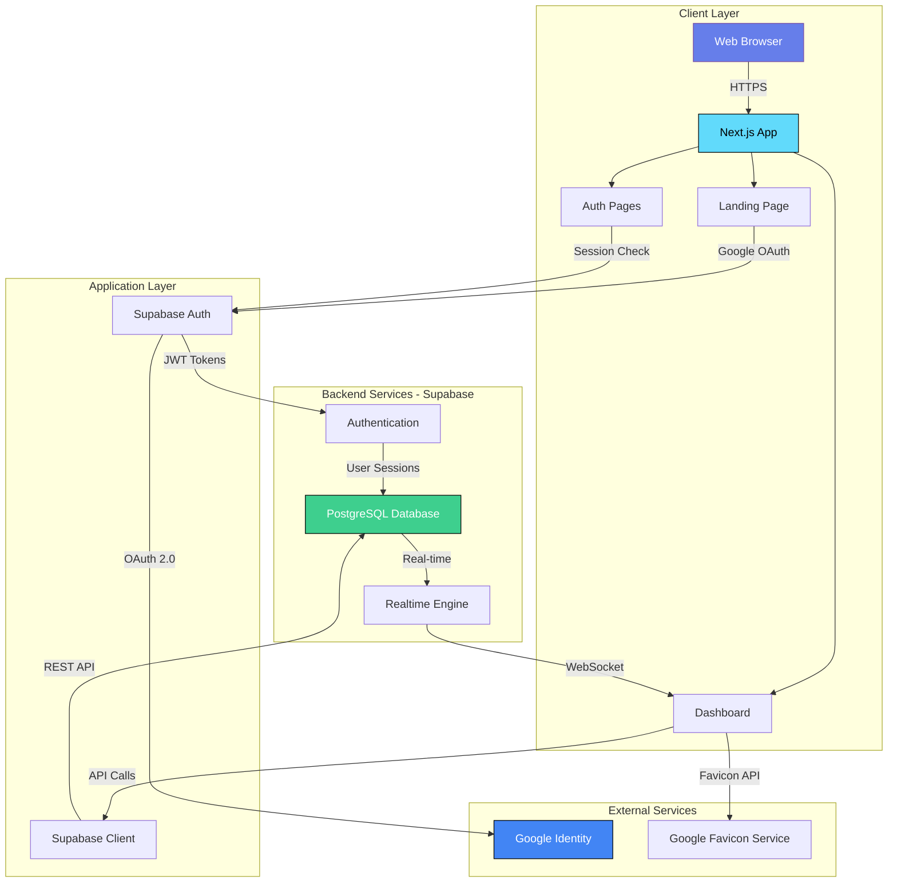

##  Data Flow Diagram

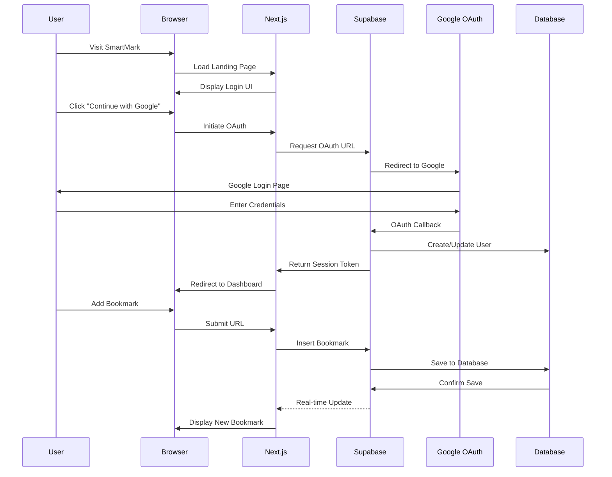

## Database Schema

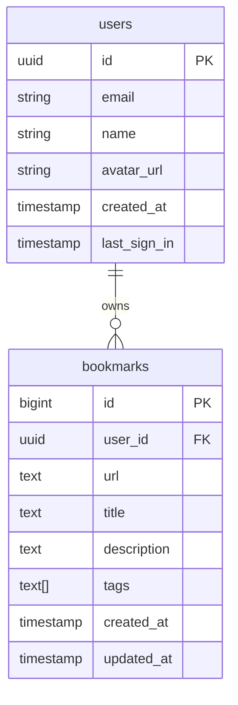

## Component Architecture

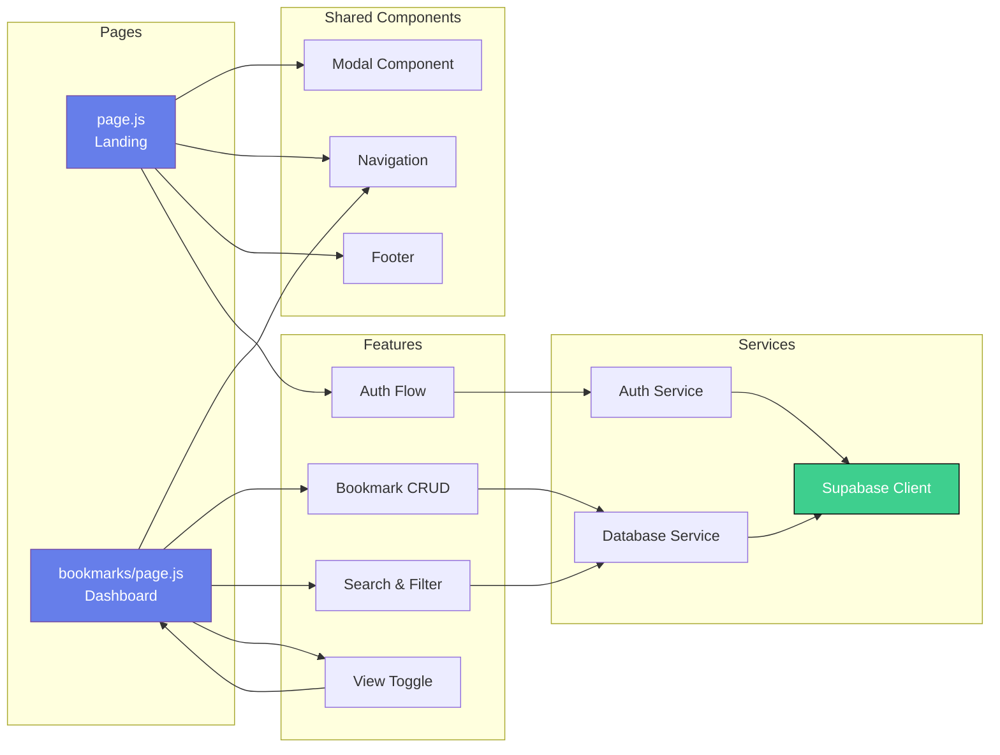

## Authentication Flow

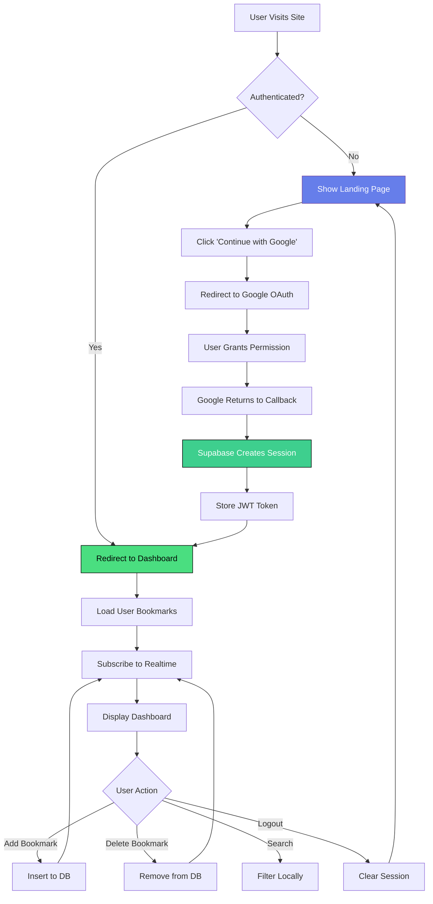

## Application State Flow

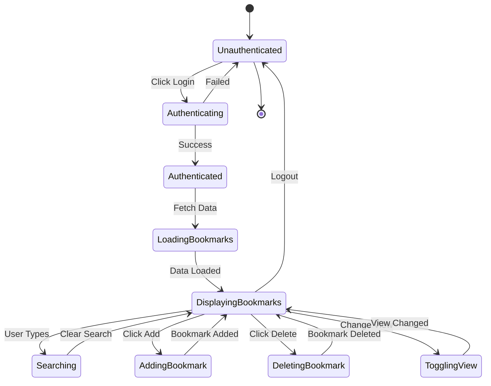

## Deployment Architecture

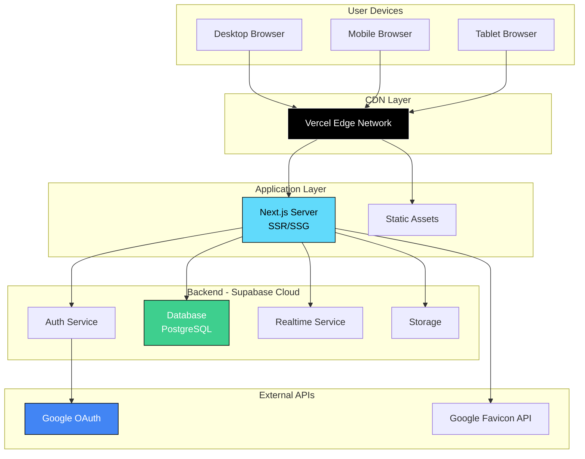

## Real-time Synchronization

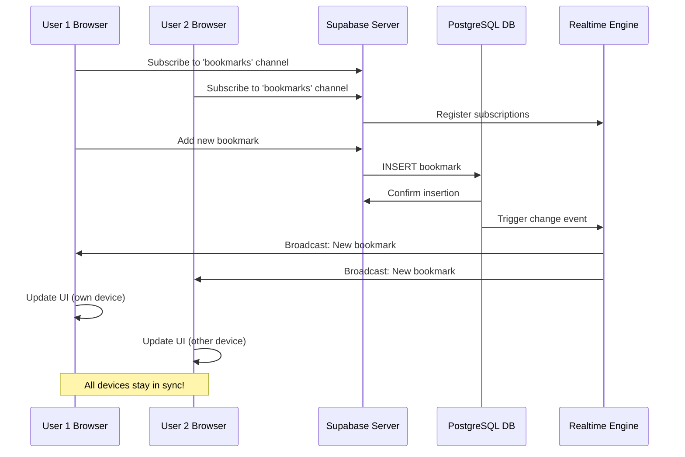

## Feature Integration Map

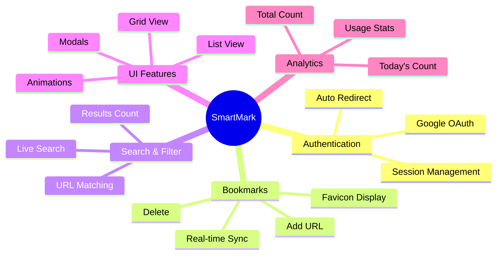

## Security Architecture

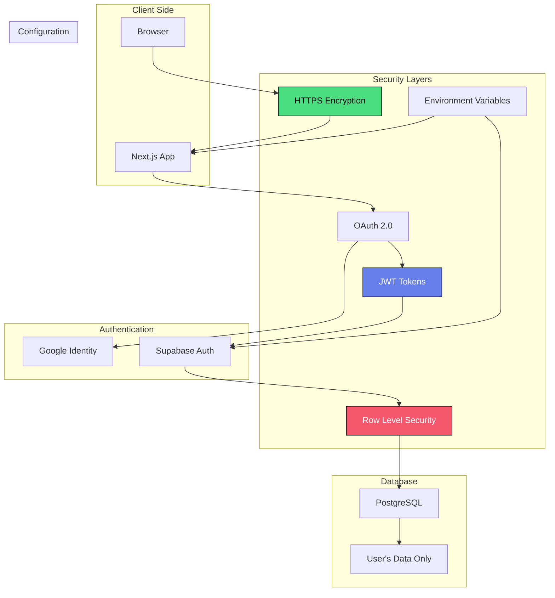

## Performance Optimization

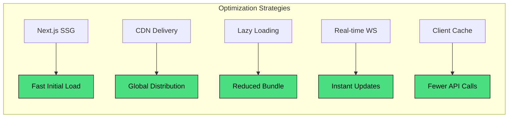

---


## Database Setup (Supabase)

Run the following SQL in Supabase SQL Editor:

```sql
CREATE TABLE bookmarks (
  id BIGSERIAL PRIMARY KEY,
  user_id UUID NOT NULL REFERENCES auth.users(id) ON DELETE CASCADE,
  url TEXT NOT NULL,
  title TEXT,
  description TEXT,
  tags TEXT[],
  created_at TIMESTAMP WITH TIME ZONE DEFAULT NOW(),
  updated_at TIMESTAMP WITH TIME ZONE DEFAULT NOW()
);

ALTER TABLE bookmarks ENABLE ROW LEVEL SECURITY;

CREATE POLICY "Users can view own bookmarks"
  ON bookmarks FOR SELECT
  USING (auth.uid() = user_id);

CREATE POLICY "Users can insert own bookmarks"
  ON bookmarks FOR INSERT
  WITH CHECK (auth.uid() = user_id);

CREATE POLICY "Users can update own bookmarks"
  ON bookmarks FOR UPDATE
  USING (auth.uid() = user_id);

CREATE POLICY "Users can delete own bookmarks"
  ON bookmarks FOR DELETE
  USING (auth.uid() = user_id);

CREATE INDEX bookmarks_user_id_idx ON bookmarks(user_id);
CREATE INDEX bookmarks_created_at_idx ON bookmarks(created_at DESC);
```

---

## Environment Variables

Create `.env.local` in project root:

```env
NEXT_PUBLIC_SUPABASE_URL=your_supabase_url
NEXT_PUBLIC_SUPABASE_ANON_KEY=your_supabase_anon_key
```

These values are available in:

Supabase Dashboard → Settings → API

---

## Google OAuth Setup

1. Enable Google provider in Supabase Authentication.
2. Configure OAuth credentials in Google Cloud Console.
3. Add redirect URLs:

Local:

```
http://localhost:3000/bookmarks
```

Production:

```
https://smart-bookmark-theta-nine.vercel.app/bookmarks
```

---

## Deployment Guide (Vercel)

1. Push project to GitHub:

```bash
git add .
git commit -m "Initial commit"
git push origin main
```

2. Go to Vercel dashboard.
3. Import GitHub repository.
4. Add environment variables:

   * NEXT_PUBLIC_SUPABASE_URL
   * NEXT_PUBLIC_SUPABASE_ANON_KEY
5. Deploy project.

After deployment:

* Update Supabase redirect URLs with production domain.
* Ensure OAuth callback configuration is correct.

---

## Project Structure

```
smartmark/
│
├── app/
│   ├── page.js
│   ├── bookmarks/
│   │   └── page.js
│   ├── layout.js
│   └── globals.css
│
├── lib/
│   └── supabaseClient.js
│
├── public/
│   ├── favicon.ico
│   └── images/
│
├── .env.local
├── .gitignore
├── next.config.js
├── package.json
└── README.md
```
## Challenges Faced & Solutions

During the development of SmartMark, several technical challenges were encountered. Below are the key issues and how they were addressed:

### 1. Google OAuth Authentication Setup
**Challenge:**  
Configuring Google OAuth with Supabase required correct redirect URLs for both local development and production deployment.

**Solution:**  
Configured Supabase Auth settings properly, added authorized redirect URIs in Google Cloud Console, and ensured environment variables were correctly set for both development and Vercel deployment.

---

### 2. Row Level Security (RLS) Implementation
**Challenge:**  
Ensuring that each user could only access their own bookmarks while maintaining database security.

**Solution:**  
Enabled Row Level Security (RLS) in Supabase and implemented policies based on `auth.uid()` so users can only view, insert, update, or delete their own data.

---

### 3. Deployment Issues on Vercel
**Challenge:**  
Handling environment variables, OAuth redirects, and production configuration during deployment.

**Solution:**  
Configured environment variables in Vercel dashboard, updated redirect URLs, and verified Supabase API integration for production use.

---

### 4. Real-time Bookmark Updates
**Challenge:**  
Ensuring bookmark updates reflect instantly without page refresh.

**Solution:**  
Used Supabase real-time subscriptions to listen for database changes and update the UI dynamically.

---

### 5. UI/UX Improvements
**Challenge:**  
Creating a modern, responsive interface while maintaining performance.

**Solution:**  
Implemented gradient backgrounds, animations, responsive layout, and optimized component styling using modern CSS practices.

---

These challenges provided valuable experience in authentication systems, secure database handling, real-time application design, and deployment workflows.

---

## Security Features

Authentication:

* Google OAuth 2.0 login
* Secure session handling
* Token auto-refresh
* Protected API routes

Database Security:

* Row Level Security enabled
* User-specific data isolation
* SQL injection protection
* Secure backend APIs

Privacy:

* HTTPS encryption
* Minimal data collection
* No data selling
* Secure cookie handling

---

## Troubleshooting

Invalid API Key:

* Verify `.env.local` file exists.
* Confirm Supabase URL and key.
* Restart development server.

OAuth Login Issues:

* Verify redirect URLs in Supabase.
* Confirm Google OAuth credentials.
* Check environment variables.

Bookmarks Not Saving:

* Ensure authentication active.
* Confirm RLS policies enabled.
* Check Supabase database logs.

Realtime Sync Issues:

* Enable Supabase realtime.
* Verify subscription code.
* Check browser console errors.

---

## Contributing

Steps to contribute:

1. Fork repository.
2. Create new branch:

```bash
git checkout -b feature-name
```

3. Make changes.
4. Commit updates:

```bash
git commit -m "Feature added"
```

5. Push branch.
6. Open Pull Request.

Code guidelines:

* Follow existing project structure.
* Maintain readable code.
* Write clear commit messages.

---

## Roadmap

Phase 1 (Completed)

* Authentication system
* Bookmark CRUD functionality
* Real-time sync
* Search system
* Responsive UI

Phase 2 (Planned)

* AI auto-tagging
* Collections/folders
* Bookmark analytics improvements
* Browser extension

Phase 3 (Future)

* Collaboration features
* Social sharing
* Mobile application
* Advanced analytics

Phase 4 (Long-term)

* Team workspace support
* API integrations
* Enterprise deployment options

---

## License

MIT License

Copyright (c) 2026 SmartMark

Permission is hereby granted, free of charge, to any person obtaining a copy of this software and associated documentation files to deal in the software without restriction.

The software is provided "as is", without warranty of any kind.

---

## Contact

<div align="center">

### **Kowshik BH**

[](mailto:kowshikbh18@gmail.com)
[](https://www.linkedin.com/in/kowshikbh)
[](https://github.com/Kowshik-bh18)

</div>


---

Version: 1.0.0
Status: Active Development
